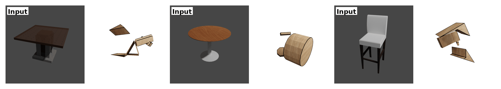

# (SIGGRAPH Asia 2025) Img2CAD: Reverse Engineering 3D CAD Models from Images

[](https://arxiv.org/abs/2408.01437)
[](https://qq456cvb.github.io/projects/img2cad)
[](https://www.python.org/downloads/release/python-380/)
[](https://opensource.org/licenses/MIT)



> **Img2CAD: Reverse Engineering 3D CAD Models from Images through VLM-Assisted Conditional Factorization**  
> *Yang You, Mikaela Angelina Uy, Jiaqi Han, Rahul Thomas, Haotong Zhang, Yi Du, Hansheng Chen, Francis Engelmann, Suya You, Leonidas Guibas*  
> Stanford University, NVIDIA, Peking University, DEVCOM Army Research Laboratory

> Accepted to SIGGRAPH Asia 2025

## Overview

Img2CAD is a novel framework for reverse engineering 3D CAD models from single-view images. Our approach conditionally factorizes the complex image-to-CAD task into two manageable sub-problems:

1. **Discrete Structure Prediction**: Using finetuned Llama to predict the global discrete CAD command structure with semantic information
2. **Continuous Parameter Prediction**: Using TrAssembler, a transformer-based network, to predict continuous parameter values conditioned on the discrete structure


## 🏗️ Repository Structure

```
Img2CAD/
├── LlamaFT/                    # Fine-tuning code for discrete structure prediction
│   ├── finetune.py            # Fine-tuning script for Llama models
│   ├── infer.py               # Unified inference: images -> h5 files
│   └── prompt.txt             # Prompt template for VLM
├── TrAssembler/               # Continuous parameter prediction
│   ├── model.py               # TrAssembler model implementation
│   ├── dataset.py             # Dataset processing for TrAssembler
│   ├── train.py               # Training script for TrAssembler
│   ├── eval.py                # Evaluation script
│   └── config.yaml            # Configuration file
├── data/                      # Data directory (to be created)
│   ├── raw_annotated/         # Raw annotated CAD data
│   │   ├── chair/             # Chair category data
│   │   ├── table/             # Table category data
│   │   └── storagefurniture/  # Storage furniture data
│   ├── blender_renderings/    # Rendered images (.png files)
│   ├── sym_labels/            # Per-object symmetry labels (text files)
│   ├── llamaft_gt_labels/     # Ground truth labels for LlamaFT training
│   │   ├── chair/             # Text labels for chair category
│   │   ├── table/             # Text labels for table category
│   │   └── storagefurniture/  # Text labels for storage furniture
│   ├── splits/                # Train/test splits
│   │   ├── chair_train_ids.txt
│   │   ├── chair_test_ids.txt
│   │   └── ...
│   ├── partnet2common_*.json  # Part name mappings for each category
│   ├── *_mean_scale_stats.json # Statistical data for normalization
│   ├── output/                # Generated during inference
│   │   ├── llamaft_h5/        # H5 files from LlamaFT inference
│   │   └── trassembler_h5/    # Final output from TrAssembler
│   └── trassembler_data/      # Preprocessed data for TrAssembler
│       ├── chair_pkl/         # Processed chair data
│       ├── table_pkl/         # Processed table data
│       └── storagefurniture_pkl/
├── utils/                     # Utility functions
│   └── cmd_to_vec.py          # CAD command to vector conversion
├── cadlib/                    # CAD processing library
├── GMFlow/                    # Gaussian Mixture Flow submodule
└── requirements.txt           # All project dependencies
```

## 🚀 Quick Start

### Prerequisites

- Python 3.8+
- CUDA-compatible GPU
- 16GB+ RAM

### Installation

1. Clone the repository with all submodules:
```bash
git clone --recursive https://github.com/qq456cvb/Img2CAD.git
cd Img2CAD
```

If you've already cloned without submodules, initialize them:
```bash
git submodule update --init --recursive
```

2. Create and activate a virtual environment:
```bash
python -m venv img2cad_env
source img2cad_env/bin/activate  # On Windows: img2cad_env\Scripts\activate
```

3. Install all dependencies:
```bash
pip install -r requirements.txt
```

### Dataset Setup

1. Download the raw annotated dataset to `data/raw_annotated/`
2. Download rendered images to `data/blender_renderings/`
3. Download ground truth labels for LlamaFT training to `data/llamaft_gt_labels/`
4. Download category-specific JSON files (part name mappings and statistics)
5. Download symmetry labels for each object to `data/sym_labels/`
6. Ensure train/test splits are in `data/splits/`

All datasets are available at this [Google Drive link](https://drive.google.com/drive/folders/1HZYa5SF5Wt4f3iq6zNFaCXHUeKuF2p-D?usp=sharing).

Expected data structure:
```
data/
├── raw_annotated/
│   ├── chair/
│   │   ├── 12345/
│   │   │   ├── cad.h5
│   │   │   └── raw.obj
│   │   └── ...
│   ├── table/
│   └── storagefurniture/
├── blender_renderings/
│   ├── 12345.png
│   └── ...
├── sym_labels/
│   ├── 12345.txt              # 1=rotational, 2=reflection, 3=no_symmetry
│   └── ...
├── llamaft_gt_labels/
│   ├── chair/
│   │   ├── 12345.txt
│   │   └── ...
│   ├── table/
│   └── storagefurniture/
├── splits/
│   ├── chair_train_ids.txt
│   ├── chair_test_ids.txt
│   └── ...
├── partnet2common_chair.json
├── partnet2common_table.json
├── partnet2common_storagefurniture.json
├── chair_mean_scale_stats.json
├── table_mean_scale_stats.json
├── storagefurniture_mean_scale_stats.json
├── output/                    # Created during inference
│   ├── llamaft_h5/
│   │   ├── chair/
│   │   ├── table/
│   │   └── storagefurniture/
│   └── trassembler_h5/
└── trassembler_data/          # Created during dataset preparation
    ├── chair_pkl/
    ├── table_pkl/
    └── storagefurniture_pkl/
```
The **raw annotated `.h5` files** store the CAD command data for each object. The keys in each file correspond to the **part names** (e.g., `"leg"`, `"top"`, etc.), and if an object has only one part, the model still works seamlessly by feeding that single part into TrAssembler. Keys ending with `_bbox` represent the **3D bounding box** of the corresponding part. The values are **CAD parameters** following the DeepCAD convention: a 2D array where each row encodes a drawing command, such as `L, x, y`, representing a point on the line (polygon).


## 🎯 Usage

### Stage 1: Discrete Structure Prediction with LlamaFT

1. **Fine-tune the vision-language model**:
```bash
python LlamaFT/finetune.py --category chair --nepochs 10 --output_dir data/ckpts/llamaft
```

2. **Generate h5 files containing discrete structures from images**:
```bash
python LlamaFT/infer.py --category chair --split test --out_dir data/output/llamaft_h5/chair  # This will be used for the inference of TrAssembler
```

### Stage 2: Continuous Parameter Prediction with TrAssembler

1. **Prepare the dataset** (Optional):
```bash
python TrAssembler/dataset.py  # This will create data/trassembler_data/{category}_pkl directories
```
Or you can directly download our processed pickle data.

2. **Train TrAssembler**:
```bash
# Using default config
python TrAssembler/train.py --category chair

# With custom parameters
python TrAssembler/train.py --category chair --batch_size 16 --max_epochs 150 --lr 2e-4
```

3. **Evaluate the model**:
```bash
python TrAssembler/eval.py --model_dir data/ckpts/trassembler/chair --text_emb_retrieval
```

## 📊 Configuration

### TrAssembler Configuration

The training can be customized using YAML configuration files:

- `config.yaml`: Base configuration

Key configuration options:

```yaml
# Dataset
category: chair  # chair, table, storagefurniture
batch_size: 8

# Training
max_epochs: 300
lr: 3e-4
weight_decay: 1e-2

# Model architecture
network:
  embed_dim: 64
  num_heads: 8
  dropout: 0.

# Gaussian Mixture Flow
gm:
  shift: 0.5
```

### LlamaFT Configuration

**Fine-tuning (finetune.py):**
- `--category`: Dataset category (chair, table, storagefurniture)
- `--nepochs`: Number of fine-tuning epochs
- `--output_dir`: Directory to save fine-tuned models

**Unified Inference (infer.py):**
- `--category`: Dataset category (default: chair)
- `--split`: Data split (default: test)
- `--img_dir`: Directory containing input images (default: data/blender_renderings)
- `--out_dir`: Directory to save h5 files (default: data/output/llamaft_h5/{category})
- `--adapter_path`: Path to fine-tuned adapter (auto-detected if not provided)
- `--num_tokens`: Max tokens per response (default: 1024)
- `--max_samples`: Limit processing to first N samples (for testing)
- `--save_text`: Save intermediate text responses for debugging
- `--hf_token`: Hugging Face authentication token

## 🔧 Evaluation Metrics

The evaluation script computes:
- **Chamfer Distance (CD)**: Geometric similarity to ground truth
- **Segmentation Accuracy and mIoU**: Part-level accuracy metrics (Coding cleaning, coming soon)


## 📝 Citation

If you find this work useful, please cite our paper:

```bibtex
@article{you2024img2cad,
  title={Img2CAD: Reverse Engineering 3D CAD Models from Images through VLM-Assisted Conditional Factorization},
  author={You, Yang and Uy, Mikaela Angelina and Han, Jiaqi and Thomas, Rahul and Zhang, Haotong and Du, Yi and Chen, Hansheng and Engelmann, Francis and You, Suya and Guibas, Leonidas},
  journal={arXiv preprint arXiv:2408.01437},
  year={2024}
}
```

## 📄 License

This project is licensed under the MIT License - see the [LICENSE](LICENSE) file for details.

## 🙏 Acknowledgments

- The authors thank the open-source community for their valuable tools and libraries, including [DeepCAD](https://github.com/rundiwu/DeepCAD) and [GMFlow](https://github.com/lakonik/gmflow).

## 📞 Contact

For questions or issues, please:
- Open an issue on GitHub
- Contact the authors: yangyou@stanford.edu

## 🔗 Links

- [Paper (arXiv)](https://arxiv.org/abs/2408.01437)
- [Project Page](https://qq456cvb.github.io/projects/img2cad)
- [Dataset](https://drive.google.com/drive/folders/1HZYa5SF5Wt4f3iq6zNFaCXHUeKuF2p-D?usp=sharing)
